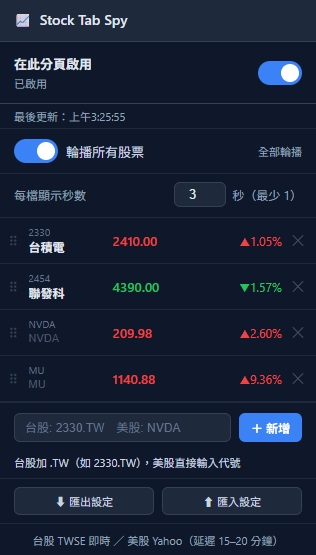

# Stock Tab Spy 📈

> 低調在瀏覽器分頁追蹤台股、美股即時行情  
> 把股價藏進分頁標題和小小的走勢 icon，讓你在辦公室也能偷偷看盤。




---

## 安裝方式

> 目前為開發者模式安裝，尚未上架 Chrome Web Store。

1. 下載或 clone 此專案到本機：
   ```
   git clone https://github.com/lovebuizel/stock-tab-spy.git
   ```
2. 開啟 Chrome，網址列輸入 `chrome://extensions`
3. 右上角開啟「**開發人員模式**」
4. 點「**載入未封裝項目**」，選擇剛才下載的資料夾
5. 工具列出現擴充功能圖示即安裝成功

---

## 使用方式

1. 開啟任意網頁，點擊工具列的 📈 圖示
2. 開啟「**在此分頁啟用**」開關
3. 分頁標題和 icon 會立即顯示股票行情
4. 可新增、移除、拖拉排序自選股
5. 點選股票名稱欄位可輸入自訂別名（台股會自動帶入中文名稱）

### 顯示模式

| 模式 | 說明 |
|------|------|
| **輪播**（預設）| 多檔股票輪流顯示，可設定每檔停留秒數 |
| **靜態** | 關閉輪播，固定顯示指定的一檔 |

### 注意事項

- 啟用狀態**僅限當前分頁**，換頁或重新載入後需重新開啟
- 每個分頁可獨立設定（輪播 / 靜態 / 顯示哪一檔）
- 自選股清單和別名為**全域共用**，所有分頁一致

### 匯出 / 匯入設定

點 popup 底部的「⬇ 匯出設定」可將自選股、別名、輪播秒數匯出為 JSON 檔，換電腦或重裝時用「⬆ 匯入設定」還原。

---

## 資料來源

| 市場 | 來源 | 延遲 |
|------|------|------|
| 台股（上市/上櫃）| TWSE MIS API | 即時（每 10 秒更新）|
| 美股 | Yahoo Finance | 約 15–20 分鐘 |

---

## 授權

[MIT License](LICENSE) © 2026

---

## 技術架構（開發者 / AI 參考）

### 專案結構

```
stock-tab-spy/
├── manifest.json      # 擴充功能設定（MV3）
├── background.js      # Service Worker：資料抓取、分頁管理、訊息路由
├── content.js         # 注入每個網頁：標題輪播、favicon 走勢圖
├── popup.html         # 擴充功能 popup UI
└── popup.js           # Popup 互動邏輯
```

### 核心設計

#### 資料流

```
chrome.alarms (1分鐘)
      │
      ▼
background.js: fetchAll()
      │  fetchTWOnly() ← setInterval (10秒，僅台股)
      │
      ├── fetchTWStock(symbol)
      │     ├── fetchTWSEPrice(code)   → TWSE MIS API（即時買賣掛單）
      │     └── fetchYahooHistory(sym) → Yahoo v8 API（走勢歷史）
      │
      └── fetchYahooStock(symbol)      → Yahoo v8 API（美股完整資料）
            │
            ▼
      chrome.storage.local { stocks, symbols, lastUpdated }
            │
            ├── chrome.tabs.sendMessage → content.js: stockUpdate
            └── chrome.storage.onChanged → popup.js: renderList()
```

#### 各模組職責

**`background.js`（Service Worker）**
- 管理自選股清單（`chrome.storage.local`）
- 管理已啟用的分頁清單（`chrome.storage.session`）
- 每分鐘全量更新（`chrome.alarms`），台股每 10 秒快更（`setInterval`）
- TWSE session 管理：每 5 分鐘重建 JSESSIONID cookie
- 收到 `enableTab` 時立即啟動 fetch 並推送資料給 content script

**`content.js`（注入腳本）**
- 注入所有頁面，但只在收到啟用通知後才運作
- 使用 `MutationObserver` 保護 `<title>` 不被頁面覆蓋
- 使用 `MutationObserver` 監控 `<head>`，移除網站動態插入的 favicon
- 用 Canvas 預先渲染所有自選股的 32×32 走勢 sparkline 成 Blob URL
- 支援輪播（`setInterval`）和靜態模式

**`popup.js`**
- 顯示自選股清單（價格隨 `chrome.storage.onChanged` 即時更新）
- 管理 per-tab 設定（存 `chrome.storage.session`，分頁關閉即清除）
- 全域設定（自選股順序、別名、輪播秒數）存 `chrome.storage.local`
- 拖拉排序用 HTML5 Drag and Drop API
- 匯出用 Blob + `<a download>`，匯入用 `FileReader`

#### 儲存策略

| 資料 | Storage | 原因 |
|------|---------|------|
| 自選股清單 `symbols` | `local` | 持久、跨分頁共用 |
| 股票資料 `stocks` | `local` | 持久，避免重複 fetch |
| 股票別名 `aliases` | `local` | 持久、跨分頁共用 |
| 輪播秒數 `rotateSeconds` | `local` | 持久、跨分頁共用 |
| 已啟用分頁 `enabledTabs` | `session` | 瀏覽器重啟後清除 |
| 分頁設定 `tabSettings_${tabId}` | `session` | 分頁關閉後清除 |

#### TWSE 即時資料機制

TWSE MIS REST API（`getStockInfo.jsp`）回傳即時委買/賣掛單資料：
- `z`：最後成交價（兩筆成交之間為 `"-"`）
- `b`：買五檔價格（`_` 分隔，`0.0000` 代表市價單需跳過）
- `y`：昨收價
- `h` / `l`：今日最高/最低
- `n`：股票中文名稱（自動填入別名）

當 `z === "-"` 時，使用買一價作為即時報價近似值（對流動性高的股票誤差 ≤ 1 tick）。

需先 `fetch` TWSE 主頁取得 `JSESSIONID` cookie，並每 5 分鐘重建 session。

#### Favicon Sparkline 渲染

- Y 軸：以 `dayHigh` / `dayLow`（加 8% padding）為範圍縮放
- X 軸：寬度 = `sessionRatio × 畫布寬`（開盤中畫到當前時間比例，收盤後或未開盤顯示完整）
- 顏色：漲為紅（`#ef4444`），跌為綠（`#22c55e`），符合台股習慣
- 最新點：額外畫一個小圓點標記

#### `sessionRatio` 計算

```
now < session.start  → 1.0（尚未開盤，顯示前一交易日完整走勢）
now > session.end    → 1.0（已收盤，顯示完整走勢）
開盤中               → (now - start) / (end - start)
```

使用系統時間（`Date.now()`）而非 API 回傳時間，避免資料延遲影響 X 軸比例。

### 主要訊息類型（`chrome.runtime.sendMessage`）

| 方向 | type | 說明 |
|------|------|------|
| popup → bg | `isTabEnabledById` | 查詢分頁是否已啟用 |
| popup → bg | `enableTab` | 啟用指定分頁 |
| popup → bg | `disableTab` | 停用指定分頁 |
| popup → bg | `getStocks` | 取得股票資料和清單 |
| popup → bg | `saveSymbols` | 新增/移除股票（會觸發 fetch）|
| popup → bg | `saveOrder` | 僅更新順序（不觸發 fetch）|
| content → bg | `isTabEnabled` | 頁面載入時自我查詢 |
| bg → content | `tabEnabled` | 通知分頁啟用並傳入初始資料 |
| bg → content | `tabDisabled` | 通知分頁停用 |
| bg → content | `stockUpdate` | 推送最新股票資料 |
| popup → content | `applySettings` | 設定變更時直接推給 content |

### 已知限制

- 台股資料在兩筆成交之間會以買一價替代，冷門股誤差較大
- TWSE 的 REST endpoint 非專為高頻輪詢設計，fetch 頻率維持 10 秒以避免被封鎖
- 美股使用 Yahoo Finance 非官方 API，延遲約 15–20 分鐘
- Service Worker 可能被瀏覽器休眠，`chrome.alarms`（1 分鐘）喚醒後會重啟台股 timer
- Content script 在特殊頁面（`chrome://`、PDF 等）無法存取 `chrome.storage`，已加 try-catch 防護
